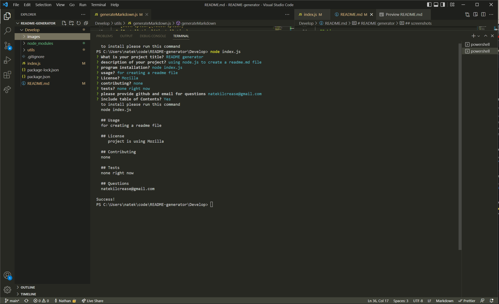
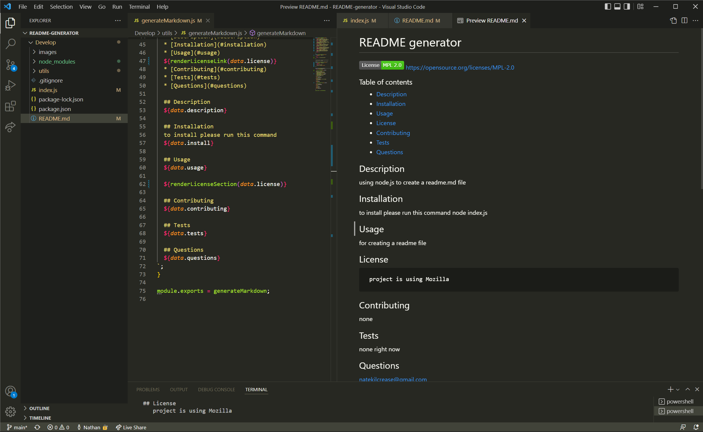

# README generator

   https://opensource.org/licenses/MPL-2.0

  ### Table of contents
  * [Description](#description)
  * [Installation](#installation)
  * [Usage](#usage)
  * [License](#license)
  * [Contributing](#contributing)
  * [Tests](#tests)
  * [Questions](#questions)
  
  ## Description 
  using node.js to create a readme.md file 

  ## Installation
  to install please run this command
  node index.js

  ## Usage
  for creating a readme file

  ## License
     project is using Mozilla

  ## Contributing
  none

  ## Tests
  none right now

  ## Questions
  natekilcrease@gmail.com
  
  ## video
  [Link to video](https://youtu.be/NNYcF7dF1zM)

  ## links
  [Git hub repository](https://github.com/batemanz/README-generator.git)  

  ## screenshots
  

  

